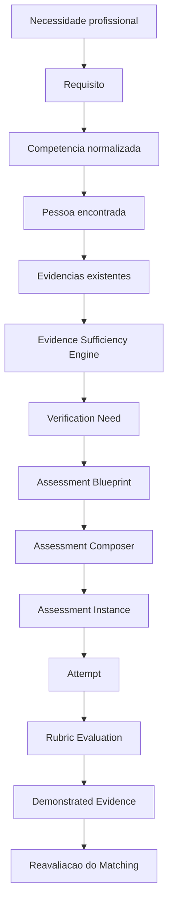

# Arquitetura do M5.1 - Verificação de Competências

## Estado

Este documento descreve a arquitetura do M5.1. O M5.1A prepara o instrumento; o M5.1B executa a verificação; o M5.1C governa expansão, custo, revisão, analytics e calibração progressiva do Banco de Itens. Produção separada, provider de delivery, uso com Pessoas reais e geração externa ativa não existem.

## Bounded context

O M5.1 pertence ao domínio de Talent Intelligence e se conecta a Pessoa, Perfil profissional, Knowledge, Vaga, Matching, evidências e auditoria. Ele não cria decisão de contratação, não consolida senioridade e não transforma Pessoa em Usuário.

## Agregados planejados

| Agregado | Responsabilidade | Escopo |
| --- | --- | --- |
| Verification Need | lacuna de evidência para Pessoa, competência e necessidade profissional | tenant |
| Verification Policy | regra organizacional de suficiência e obrigatoriedade | tenant |
| Verification Definition | contrato versionado de como demonstrar uma competência | global ou tenant, conforme origem |
| Assessment Blueprint | cobertura exigida para uma verificação | global ou tenant |
| Assessment Instance | composição entregue a uma Pessoa | tenant |
| Assessment Attempt | execução, respostas, tempo e eventos | tenant |
| Demonstrated Evidence | evidência resultante, separada do Perfil factual | tenant |
| Global Assessment Item Bank | acervo compartilhado governado pelo Prisma | global |
| Organization Assessment Item Bank | acervo privado da organização | tenant |

## Implementação M5.1A

Arquivos principais:

| Camada | Implementação |
| --- | --- |
| Domínio puro | `src/domain/competencyVerification.ts` |
| Matching | `src/ai/matching.ts` expõe `verificationSufficiency` quando requisito traz nível, criticidade e policy |
| Schema | `supabase/migrations/20260901082542_m51a_verification_intelligence.sql` e hardening `20260901111841_m51a_grant_hardening.sql` |
| Web service | `web/src/infrastructure/supabase/competencyVerificationService.ts` |
| UI | `web/src/pages/CompetencyVerificationPage.tsx` e rota `/matching` |
| Testes | `tests/competencyVerification.test.ts` |

Tabelas implementadas:

- `verification_definitions`
- `verification_policies`
- `verification_needs`
- `assessment_blueprints`
- `assessment_rubrics`
- `assessment_item_families`
- `assessment_items`
- `prepared_assessments`
- `verification_audit_events`

RPCs implementadas:

- `ensure_m51a_demo_need(p_organization_id uuid)`: cria ou atualiza uma necessidade demonstrativa para a organização ativa a partir de Pessoa, Vaga e Requisito existentes, sob autorização de reviewer.
- `load_m51a_verification_workspace(p_organization_id uuid)`: carrega necessidades, definições, blueprints, rubricas, resumo do Item Bank e preparações existentes.
- `prepare_m51a_assessment(p_need_id uuid, p_definition_id uuid, p_blueprint_id uuid, p_status text, p_idempotency_key text)`: compõe instrumento deterministicamente a partir do blueprint e grava rascunho ou preparação.

Todas as tabelas públicas novas têm RLS habilitado, grants explícitos para `authenticated` e revogação de `anon`. As RPCs `security definer` usam `set search_path = ''`, chamam `private.require_document_reviewer(...)` antes de mutações tenant-owned e registram auditoria metadata-only.

O hardening M5.1A garante que `verification_needs`, `prepared_assessments` e `verification_audit_events` tenham apenas leitura direta para `authenticated`; criação e alteração de necessidades e preparações passam pelas RPCs autorizadas.

## Implementação M5.1B

O M5.1B adiciona `assessment_invitations`, `assessment_attempts`, `assessment_question_instances`, `assessment_responses`, `assessment_events`, `assessment_question_metrics`, `assessment_integrity_analyses`, `assessment_evaluations`, `competency_demonstrated_evidence` e `assessment_access_requests`.

A Edge Function `assessment-access` é a fronteira pública definida pelo ADR-027. Operadores autenticados emitem ou revogam convites por RPC autorizada. Pessoas externas apresentam somente token opaco; a função calcula SHA-256 e usa a RPC `m51b_public_access`, executável apenas por `service_role`. Nenhuma tabela crítica possui grant `anon` ou DML direto para clientes.

Início e submissão são transacionais. A primeira operação materializa snapshots imutáveis de itens, opções, resposta correta e versões. A segunda bloqueia a tentativa, calcula resultado bruto, métricas, flags, Rubrica, confiança, Evidência Demonstrada, resolução da Need e um novo `match_evaluations`. Integridade nunca modifica o resultado bruto e browser telemetry permanece sinal observável, não prova de conduta.

## Escopo global e organizacional

## Implementação M5.1C

O M5.1C adiciona `assessment_item_generation_needs`, `assessment_item_generation_requests`, `assessment_item_generation_proposals`, `assessment_item_generation_reviews`, `assessment_item_calibration_snapshots`, `assessment_item_quality_flags`, `assessment_ai_policies` e `assessment_ai_budget_ledger`. Todas as tabelas têm RLS, `anon` sem acesso e DML crítico encapsulado em RPCs autorizadas.

O fluxo é `Blueprint -> cobertura elegível -> gap -> Need -> Request -> Proposal -> validação/deduplicação -> Review -> Item`. Chaves idempotentes são serializadas por transaction advisory lock. Publicação é atômica e repetível, exige aprovação humana e preserva proposal, provider, modelo, prompt e schema. Um trigger mantém a Need entre revisão parcial, resolvida ou falha.

`assessment-item-generator` exige JWT, CORS local explícito, flag server-side, policy, orçamento, teto por pedido, limite diário, cooldown, schema estrito e validação adicional. O provider fake não usa LLM. A rota externa usa a Responses API somente quando toda configuração estiver aprovada; hoje falha fechado antes de qualquer chamada.

Snapshots analíticos são tenant-scoped mesmo para itens Global. Eles separam defined de observed, registram P25, mediana, P75, acerto, omissão, mudança e incidentes excluídos. `synthetic_qa` nunca pode receber `calibrated`. Global real não agrega tenants privados.

Knowledge Global e Organization overlay continuam separados. A mesma regra vale para avaliação:

| Domínio | Global | Organização |
| --- | --- | --- |
| Knowledge | conceitos e relações canônicas | especialização tenant-owned |
| Verification Definition | capacidade verificável e dimensões gerais | especializações aprovadas da organização |
| Item Bank | itens compartilháveis e governados | itens privados, sem promoção automática |
| Policy | não aplicável como regra de cliente | suficiência exigida pela organização |

Item de organização nunca é promovido automaticamente para o banco global por propriedade intelectual, confidencialidade, qualidade ainda não validada e risco de vazamento entre tenants.

## Contratos conceituais

### Verification Need

Campos mínimos planejados:

```text
organization_id
person_id
professional_need_type
professional_need_id
competency_concept_id
expected_level
criticality
available_evidence_refs[]
insufficient_evidence_explanation
applied_policy_id?
state
reason_codes[]
created_by
created_at
updated_at
version
```

### Verification Definition

Define se uma competência é verificável, dimensões mensuráveis, dimensões por nível, modalidades adequadas, níveis verificáveis, dimensões obrigatórias, sinais de demonstração suficiente e limites metodológicos.

Exemplo para SQL: seleção e filtragem, joins, agregações, subqueries, CTE, window functions, manipulação de dados, otimização, plano de execução e interpretação do resultado.

### Assessment Blueprint

Define competência, versão, nível-alvo, modalidade, duração, dimensões, cobertura mínima, distribuição de dificuldade, quantidade de itens, critérios mínimos, rubrica, navegação, tentativas, randomização e itens ou famílias obrigatórias/proibidas.

### Item

Item deve possuir competência, dimensão, nível-alvo, dificuldade, modalidade, tipo, idioma, tempo esperado, objetivo, família, variante, rubrica, versão, origem, status, calibração, exposição, recência e validade tecnológica.

### Demonstrated Evidence

Evidência demonstrada deve registrar necessidade, assessment, tentativa, definição, blueprint, item versions, rubrica, resultado bruto, interpretação, cobertura, integridade, confiança explicável, limitações, ator/método e timestamp.

## Nível, dificuldade e resultado

São contratos independentes:

| Conceito | Exemplo | Regra |
| --- | --- | --- |
| Nível-alvo da competência | avançado | domínio que se pretende observar |
| Dificuldade do item | alta | dificuldade daquela questão ou tarefa |
| Nível demonstrado | intermediário | interpretação da tentativa conforme rubrica e cobertura |

Não usar senioridade como label primário de item. Rótulos por senioridade devem ser evitados; preferir competência SQL, nível-alvo avançado, dimensão window functions, dificuldade alta.

## Fluxo arquitetural



## Item Bank e Composer

O Assessment Composer deve usar blueprint, competência, dimensão, nível, dificuldade, modalidade, idioma, calibração, exposição recente, itens já recebidos pela Pessoa, cooldown, família, política da organização, qualidade e versão.

Randomização pura não é suficiente. Dois assessments podem ter itens diferentes e ainda serem equivalentes se preservarem definição, blueprint, distribuição, rubrica e qualidade.

Fluxo de cold start:

```text
assessment solicitado -> blueprint -> busca no Item Bank
  -> cobertura suficiente? -> compor assessment
  -> lacuna? -> gerar somente itens faltantes
  -> revisao humana -> aprovar -> uso controlado
  -> calibracao posterior
```

## Eventos planejados

Eventos devem ser append-only e metadata-only quando possível: `verification_need_created`, `sufficiency_evaluated`, `verification_requested`, `assessment_prepared`, `invite_sent`, `attempt_started`, `item_presented`, `answer_saved`, `page_hidden`, `page_visible`, `focus_lost`, `focus_returned`, `attempt_completed`, `attempt_expired`, `attempt_marked_inconclusive`, `rubric_evaluated`, `demonstrated_evidence_recorded`, `matching_reevaluated`.

Eventos de browser são sinais observáveis. Eles não provam consulta externa, fraude ou intenção. Qualquer interpretação precisa ser versionada, testável e ligada à questão ativa.

## Integridade e confiança

Integridade não altera resultado bruto. Ela produz flags determinísticas e explicáveis. Nenhum evento isolado gera acusação. Incidentes técnicos, conexão ruim, tecnologia assistiva e pausa autorizada precisam ser diferenciados de comportamento observado.

Confiança deve considerar cobertura, qualidade metodológica, integridade da execução, recência, divergência, calibração e limites da modalidade. Não é score arbitrário.

## Persistência futura

PostgreSQL/Supabase continua o contrato de produção planejado. Qualquer futura migration deve preservar `organization_id`, FKs compostas, RLS em tabelas expostas, grants mínimos, DML direto revogado em tabelas críticas, RPCs idempotentes quando houver transação composta e falha segura para versão desconhecida.

Pessoa pode receber convite sem se tornar Usuário operacional. O acesso ao assessment deve ser tokenizado, limitado, auditável e separado de `platform_users`.

No M5.1A, `prepared_assessments` é apenas preparação interna. No M5.1B, somente uma emissão autorizada cria convite e o token correspondente; o assessment preparado isoladamente continua sem autorizar acesso externo.

## Relação com contratos existentes

- `professional-profile`: não é sobrescrito por evidência demonstrada.
- `explainable-matching`: passa a poder consumir evidência demonstrada como camada adicional.
- `knowledge-normalization`: identifica o conceito de competência, mas não define política de suficiência.
- `tenant-authorization`: continua falhando fechado para operador.
- `document-operation-idempotency`: serve como padrão para chaves e replay seguro.

## Critérios de decomposição futura

Implementação deve ser separada em movimentos menores: contratos e versões, schema/RLS, Verification Definition, Policy, Sufficiency Engine, Item Bank, Composer, tentativa, rubrica, evidência demonstrada, matching, UX operador, UX Pessoa, QA e Context Pack.
